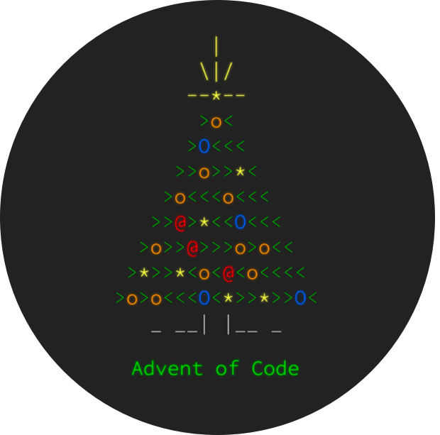

> This repository will be used for my 2024 Advent of Code submissions.

    
    
    

 

> [!INFO]
> This repository has been archived because I never got around to finishing it, and it is almost time for Advent of Code 2025.

# Advent of Code (2024)
Advent of Code is an Advent calendar of small programming puzzles for a variety of skill levels that can be solved in any programming language you like. People use them as interview prep, company training, university coursework, practice problems, a speed contest, or to challenge each other. If you'd like to support Advent of Code, you can do so indirectly by helping to share it with others or directly via [AoC++](https://adventofcode.com/2024/support).

  

    
  

I am using it to learn [Rust](http://rust-lang.org/). Rust is a fast, memory-safe, and productive programming language that can run on embedded devices, web services, and more. It's quite a hard language to learn so this is my excuse to finally learn the language. It's been going quite well so far, after about 10 challenges I seem to no longer be fighting the language as much anymore. Now I'm mostly struggling because the challenges are getting harder to solve.

## Index

| **Day** | **File**                   | **Link**                                     |
|---------|----------------------------|----------------------------------------------|
| Day 1   | [file](./src/bin/day01.rs) | [link](https://adventofcode.com/2024/day/1)  |
| Day 2   | [file](./src/bin/day02.rs) | [link](https://adventofcode.com/2024/day/2)  |
| Day 3   | [file](./src/bin/day03.rs) | [link](https://adventofcode.com/2024/day/3)  |
| Day 4   | [file](./src/bin/day04.rs) | [link](https://adventofcode.com/2024/day/4)  |
| Day 5   | [file](./src/bin/day05.rs) | [link](https://adventofcode.com/2024/day/5)  |
| Day 6   | [file](./src/bin/day06.rs) | [link](https://adventofcode.com/2024/day/6)  |
| Day 7   | [file](./src/bin/day07.rs) | [link](https://adventofcode.com/2024/day/7)  |
| Day 8   | [file](./src/bin/day08.rs) | [link](https://adventofcode.com/2024/day/8)  |
| Day 9   | [file](./src/bin/day09.rs) | [link](https://adventofcode.com/2024/day/9)  |
| Day 10  | [file](./src/bin/day10.rs) | [link](https://adventofcode.com/2024/day/10) |
| Day 11  | [file](./src/bin/day11.rs) | [link](https://adventofcode.com/2024/day/11) |
| Day 12  | [file](./src/bin/day12.rs) | [link](https://adventofcode.com/2024/day/12) |
| Day 13  | [file](./src/bin/day13.rs) | [link](https://adventofcode.com/2024/day/13) |
| Day 14  | [file](./src/bin/day14.rs) | [link](https://adventofcode.com/2024/day/14) |
| Day 15  | [file](./src/bin/day15.rs) | [link](https://adventofcode.com/2024/day/15) |
<!-- | Day 16  | [file](./src/bin/day16.rs) | [link](https://adventofcode.com/2024/day/16) |
| Day 17  | [file](./src/bin/day17.rs) | [link](https://adventofcode.com/2024/day/17) |
| Day 18  | [file](./src/bin/day18.rs) | [link](https://adventofcode.com/2024/day/18) |
| Day 19  | [file](./src/bin/day19.rs) | [link](https://adventofcode.com/2024/day/19) |
| Day 20  | [file](./src/bin/day20.rs) | [link](https://adventofcode.com/2024/day/20) |
| Day 21  | [file](./src/bin/day21.rs) | [link](https://adventofcode.com/2024/day/21) |
| Day 22  | [file](./src/bin/day22.rs) | [link](https://adventofcode.com/2024/day/22) |
| Day 23  | [file](./src/bin/day23.rs) | [link](https://adventofcode.com/2024/day/23) |
| Day 24  | [file](./src/bin/day24.rs) | [link](https://adventofcode.com/2024/day/24) |
| Day 25  | [file](./src/bin/day25.rs) | [link](https://adventofcode.com/2024/day/25) | -->
